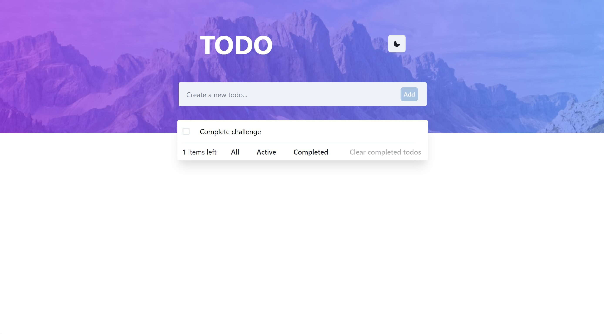

# Frontend Mentor - Todo app solution

This is a solution to the [Todo app challenge on Frontend Mentor](https://www.frontendmentor.io/challenges/todo-app-Su1_KokOW). Frontend Mentor challenges help you improve your coding skills by building realistic projects.

## Table of contents

- [Overview](#overview)
  - [The challenge](#the-challenge)
  - [Screenshot](#screenshot)
  - [Links](#links)
- [My process](#my-process)
  - [Built with](#built-with)
  - [What I learned](#what-i-learned)
  - [Continued development](#continued-development)
- [Author](#author)

## Overview

### The challenge

Users should be able to:

- View the optimal layout for the app depending on their device's screen size
- See hover states for all interactive elements on the page
- Add new todos to the list
- Mark todos as complete
- Delete todos from the list
- Filter by all/active/complete todos
- Clear all completed todos
- Toggle light and dark mode

### Screenshot

### Links

- Solution URL: [Todo app repo](https://github.com/dsaints2344/todo-challenge)
- Live Site URL: [Todo app live site](https://todo-challenge-beta.vercel.app/)

## My process

### Built with

- [React](https://reactjs.org/) - JS library
- [Chakra UI](https://chakra-ui.com/) - UI library
- [Zustand](https://zustand-demo.pmnd.rs/) - React management library
- Typescript

### What I learned

I learned how to use the zustand library (state management), implemented it in the challenge solution as a way to avoid prop drilling without too much boilerplate (given my experience with another state manager library, like redux). Also, I learned how to implement some level of responsive design using Chakra UI's utility components. And also with the same UI library, I learned how to toogle between light and dark mode.

### Continued development

I would like to learn more in-depth responsive design practices, specially, the transitions between components for different devices dimensions (mobile to desktop).

## Author

- Website - [David De Los Santos](https://dev-portafolio-three.vercel.app/)
- Frontend Mentor - [@dsaints2344](https://www.frontendmentor.io/profile/dsaints2344)
